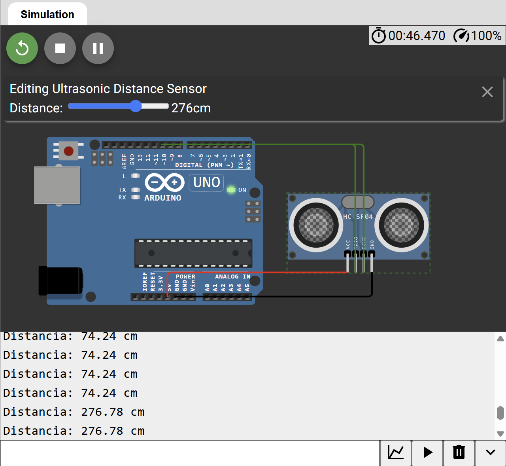

# Sensor Ultrasónico HC-SR04

## Descripción

Proyecto desarrollado en Arduino para medir distancias utilizando el sensor ultrasónico HC-SR04. La simulación fue realizada en Wokwi con el objetivo de comprender el funcionamiento de sensores de proximidad y su integración con microcontroladores.

## Objetivo

Implementar un sistema capaz de detectar la distancia entre el sensor y un objeto mediante la emisión y recepción de ondas ultrasónicas.

## Componentes Utilizados

- Arduino Uno
- Sensor ultrasónico HC-SR04
- Wokwi Simulator

## Funcionamiento

El sensor HC-SR04 emite una onda ultrasónica a través del pin TRIG. Cuando la señal rebota en un objeto, el pin ECHO devuelve el tiempo transcurrido. A partir de este tiempo se calcula la distancia utilizando la velocidad del sonido.

Proceso:

1. Generación de pulso ultrasónico.
2. Recepción del eco.
3. Medición del tiempo de retorno.
4. Cálculo de distancia.
5. Visualización en el Monitor Serial.

## Conexiones

| HC-SR04 | Arduino Uno |
|----------|------------|
| VCC | 5V |
| GND | GND |
| TRIG | D9 |
| ECHO | D10 |

## Diagrama

Ver imagen de la simulación:



## Simulación en Wokwi

La simulación completa del proyecto está disponible en el siguiente enlace:

👉 https://wokwi.com/projects/466998163343638529

Desde allí es posible:
- Visualizar el circuito.
- Ejecutar la simulación.
- Modificar la distancia del objeto.
- Observar los resultados en el Monitor Serial.

## Código

El código fuente se encuentra en:

```text
codigo/sketch.ino