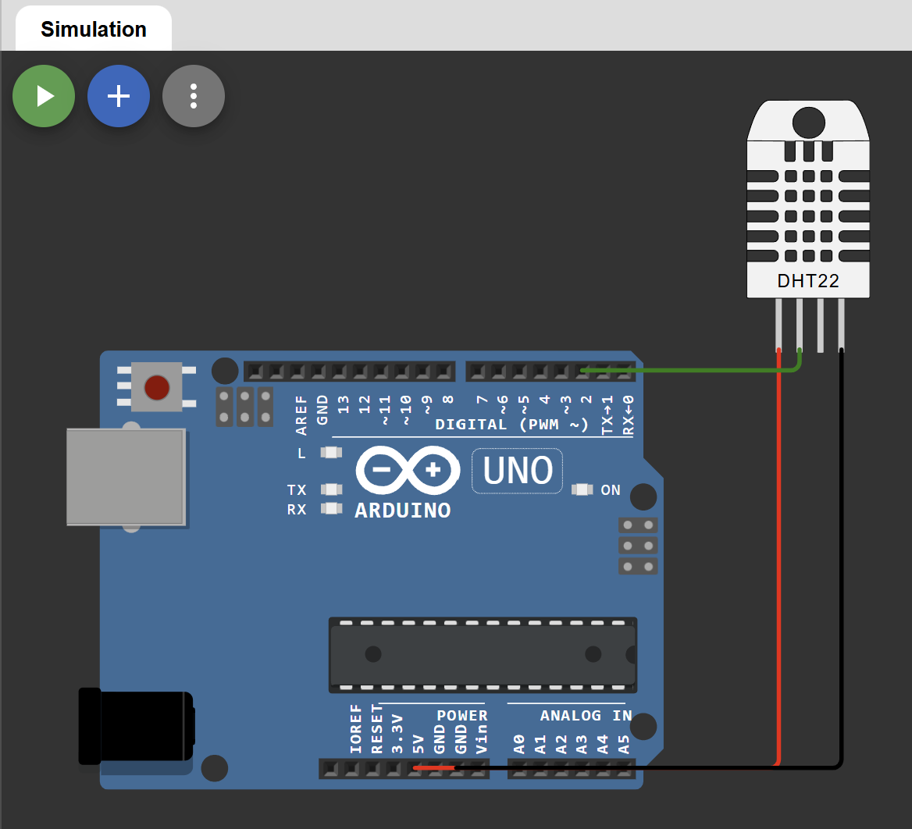

# Sensor de Temperatura y Humedad DHT22

## Descripción

Proyecto desarrollado en Arduino para monitorear temperatura y humedad ambiental utilizando el sensor DHT22. La simulación fue realizada en Wokwi con el objetivo de comprender la adquisición de datos desde sensores ambientales y su procesamiento mediante microcontroladores.

## Objetivo

Implementar un sistema capaz de medir y visualizar valores de temperatura y humedad en tiempo real a través del Monitor Serial.

## Componentes Utilizados

- Arduino Uno
- Sensor DHT22
- Wokwi Simulator

## Funcionamiento

El sensor DHT22 realiza mediciones periódicas de temperatura y humedad relativa del ambiente. Arduino recibe estos datos y los muestra en el Monitor Serial para su visualización y análisis.

Proceso:

1. Lectura de temperatura.
2. Lectura de humedad.
3. Validación de datos.
4. Visualización de resultados en el Monitor Serial.
5. Actualización continua de mediciones.

## Conexiones

| DHT22 | Arduino Uno |
|--------|------------|
| VCC | 5V |
| DATA | D2 |
| NC | Sin conectar |
| GND | GND |

## Diagrama



## Simulación en Wokwi

La simulación completa del proyecto está disponible en el siguiente enlace:

👉 https://wokwi.com/projects/466999318965794817

## Código

El código fuente se encuentra en:

```text
codigo/sketch.ino 