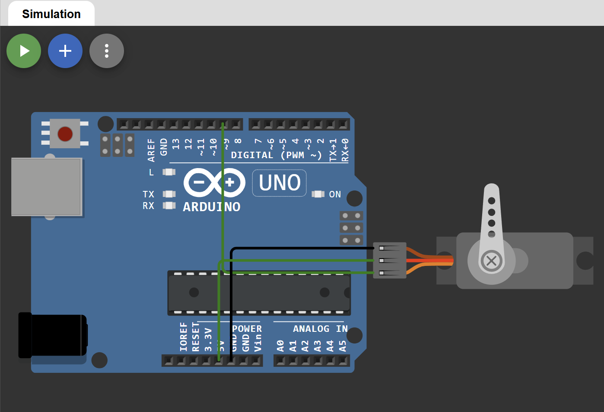

# Control de Servo Motor SG90

## Descripción

Proyecto desarrollado en Arduino para controlar la posición angular de un servomotor SG90. La simulación fue realizada en Wokwi con el objetivo de comprender el funcionamiento de actuadores electromecánicos y su integración con sistemas embebidos.

## Objetivo

Implementar un sistema capaz de posicionar un servomotor en diferentes ángulos mediante señales PWM generadas por Arduino.

## Componentes Utilizados

- Arduino Uno
- Servo Motor SG90
- Wokwi Simulator

## Funcionamiento

El servomotor recibe señales PWM desde Arduino para posicionarse en un ángulo específico entre 0° y 180°. En este proyecto se realiza un barrido automático que permite observar el movimiento progresivo del actuador.

Proceso:

1. Inicialización del servomotor.
2. Generación de señales PWM.
3. Movimiento gradual desde 0° hasta 180°.
4. Retorno gradual desde 180° hasta 0°.
5. Repetición continua del ciclo.

## Conexiones

| Servo SG90 | Arduino Uno |
|------------|------------|
| GND (Marrón) | GND |
| VCC (Rojo) | 5V |
| Signal (Naranja) | D9 |

## Diagrama



## Simulación en Wokwi

La simulación completa del proyecto está disponible en el siguiente enlace:

👉 https://wokwi.com/projects/467006111985163265

## Código

El código fuente se encuentra en:

```text
codigo/sketch.ino
```

## Resultado

El servomotor realiza movimientos controlados dentro de su rango de operación.

Secuencia ejecutada:

```text
0° → 180°
180° → 0°
0° → 180°
...
```

## Conceptos Aplicados

- Actuadores electromecánicos
- Señales PWM
- Control de posición angular
- Sistemas embebidos
- Automatización básica
- Programación de microcontroladores

## Posibles Aplicaciones Industriales

- Brazos robóticos
- Sistemas de clasificación de productos
- Posicionamiento de cámaras de seguridad
- Control de válvulas automatizadas
- Apertura y cierre de compuertas
- Sistemas de dosificación
- Automatización industrial
- Robótica educativa

## Tecnologías Utilizadas

- Arduino
- C/C++
- Servo SG90
- Wokwi
- Git
- GitHub

## Autor

Gefferson Casasola  
Ingeniero Electrónico | Desarrollador Backend