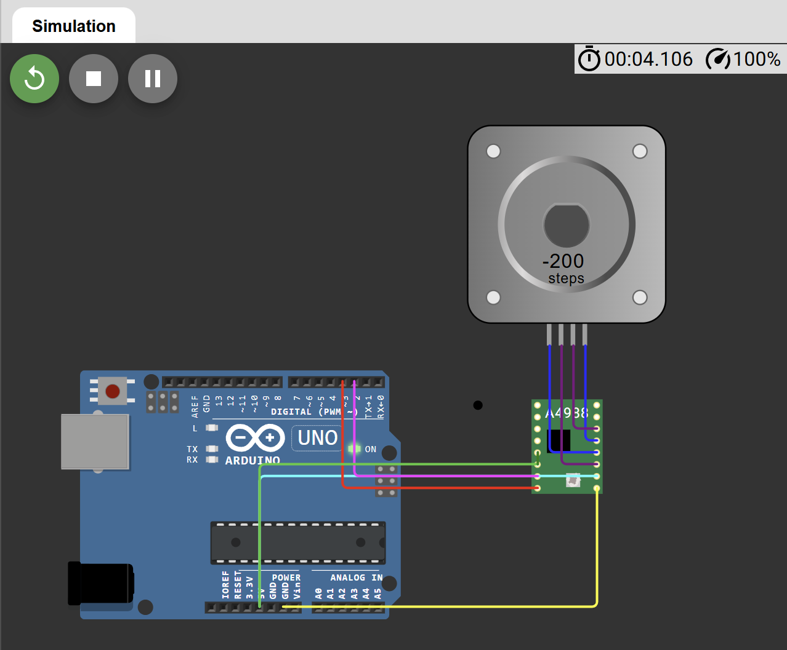

# Control de Motor Paso a Paso con A4988

## Descripción

Proyecto desarrollado en Arduino para controlar un motor paso a paso bipolar mediante el driver A4988. La simulación fue realizada en Wokwi con el objetivo de comprender el funcionamiento de sistemas de control de movimiento utilizados en automatización industrial, robótica e impresión 3D.

## Objetivo

Implementar un sistema capaz de controlar la dirección y el desplazamiento de un motor paso a paso utilizando señales STEP y DIR generadas por Arduino.

## Componentes Utilizados

- Arduino Uno
- Driver A4988
- Motor Paso a Paso Bipolar
- Wokwi Simulator

## Funcionamiento

El driver A4988 recibe señales digitales desde Arduino para controlar el movimiento del motor:

- **STEP:** determina cada paso del motor.
- **DIR:** define el sentido de giro.

El programa realiza una secuencia de movimiento en ambos sentidos para demostrar el control de dirección y posicionamiento.

Proceso:

1. Configuración de los pines STEP y DIR.
2. Giro del motor en sentido horario.
3. Pausa de seguridad.
4. Giro del motor en sentido antihorario.
5. Repetición continua del ciclo.

## Conexiones

### Arduino → A4988

| Arduino | A4988 |
|----------|--------|
| D2 | STEP |
| D3 | DIR |
| 5V | VDD |
| GND | GND |

### A4988 → Motor Paso a Paso

| A4988 | Motor |
|---------|---------|
| 1A | 1-A |
| 1B | 1+A |
| 2A | 1-B |
| 2B | 1+B |

### Habilitación del Driver

| A4988 | Conexión |
|---------|---------|
| RESET | SLEEP |
| RESET + SLEEP | 5V |

## Diagrama



## Simulación en Wokwi

La simulación completa del proyecto está disponible en el siguiente enlace:

👉 https://wokwi.com/projects/467012816904313857

## Código

El código fuente se encuentra en:

```text
codigo/sketch.ino
```

## Resultado

El motor realiza movimientos controlados en ambos sentidos.

Secuencia ejecutada:

```text
↻ Giro horario
↓
200 pasos
↓
Pausa
↓
↺ Giro antihorario
↓
200 pasos
```

## Conceptos Aplicados

- Motores paso a paso
- Control de movimiento
- Drivers de potencia
- Señales STEP y DIR
- Sistemas embebidos
- Automatización industrial
- Control de posicionamiento

## Posibles Aplicaciones Industriales

- Impresoras 3D
- Máquinas CNC
- Robots cartesianos
- Sistemas pick-and-place
- Sistemas de dosificación
- Posicionamiento de precisión
- Equipos de manufactura automatizada
- Líneas de ensamblaje industrial

## Tecnologías Utilizadas

- Arduino
- C/C++
- Driver A4988
- Stepper Motor
- Wokwi
- Git
- GitHub